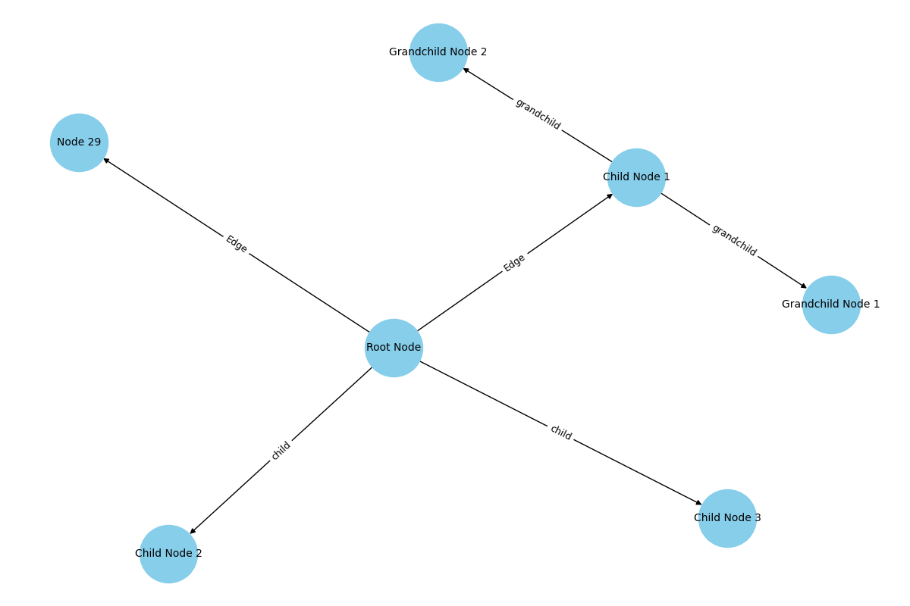

# Tree Manager

A Python library to manage hierarchical tree structures in SQL databases.

### Installation

```bash
https://github.com/saswatnayak1998/tree_versioning_system.git
cd tree_manager
pip install -e .
```

### Run tests

```bash
python tests/test_tree_manager.py
```

### Populate the db with sample data

```bash
python populate.py
```

### Database Implementation

## Models

### Tree

- **Attributes**:
  - `id`: Unique identifier for the tree.
  - `name`: Name of the tree.
  - `created_at`: Timestamp of when the tree was created.
- **Relationships**: Has many `TreeNode` and `TreeTag` instances.
- **Methods**:
  - `get(session, id)`: Retrieves a tree by its ID.
  - `get_by_tag(session, tag_name)`: Retrieves a tree by its tag name.
  - `create_tag(session, tag_name, description=None)`: Creates a new tag for the tree.
  - `create_new_tree_version_from_tag(session, tag_name)`: Creates a new tree version based on a specified tag.
  - `restore_from_tag(session, tag_name)`: Restores the tree to a state defined by a specified tag.
  - `add_node(session, data)`: Adds a new node to the tree.
  - `add_edge(session, incoming_node_id, outgoing_node_id, data=None)`: Adds a new edge between two nodes.
  - `get_root_nodes(session)`: Retrieves all root nodes of the tree.
  - `get_node(session, node_id)`: Retrieves a node by its ID.
  - `get_child_nodes(session, node_id)`: Retrieves child nodes of a specified node.
  - `get_parent_nodes(session, node_id)`: Retrieves parent nodes of a specified node.
  - `get_node_edges(session, node_id)`: Retrieves all edges connected to a specified node.
  - `get_nodes_at_depth(session, depth)`: Retrieves nodes at a specified depth in the tree.
  - `find_path(session, start_node_id, end_node_id)`: Finds a path between two nodes.

### TreeNode

- **Attributes**:
  - `id`: Unique identifier for the node.
  - `tree_id`: Reference to the associated tree.
  - `data`: Additional data associated with the node.
  - `created_at`: Timestamp of when the node was created.
- **Relationships**: Has many incoming and outgoing `TreeEdge` instances.
- **Methods**:
  - `has_incoming_edges(session)`: Checks if the node has any incoming edges.

### TreeEdge

- **Attributes**:
  - `id`: Unique identifier for the edge.
  - `incoming_node_id`: Reference to the incoming node.
  - `outgoing_node_id`: Reference to the outgoing node.
  - `data`: Additional data associated with the edge.
  - `created_at`: Timestamp of when the edge was created.
- **Relationships**: Connects two `TreeNode` instances.

### TreeTag

- **Attributes**:
  - `id`: Unique identifier for the tag.
  - `tree_id`: Reference to the associated tree.
  - `tag_name`: Name of the tag.
  - `description`: Description of the tag.
  - `snapshot`: JSON representation of the tree's state at the time of tagging.
  - `created_at`: Timestamp of when the tag was created.
- **Relationships**: Belongs to a `Tree`.

### Visualize the tree by id

```bash
python visualize_tree.py <tree_id>
```

# Example



## Design Desisions

- I made a new table called TreeTag which keeps the tag for a particular Tree. When you do create_tag for a particular tree, it saves the state of that tree in the field of snapshot as json. This allows to revert back to the tree structure when the tag was created.

## Improvements for larger databases

In the code, there are several areas where SQL indexes can improve performance, especially in queries that filter or join on specific columns. Here are some areas where I can add indexes:
TreeTag Table: Since I frequently query TreeTag by tree_id and tag_name, adding a composite index on these columns can speed up lookups.
TreeNode Table: I often query TreeNode by tree_id and id. Adding an index on tree_id can help with performance when filtering nodes by tree.
TreeEdge Table: I frequently filter by incoming_node_id and outgoing_node_id. Adding indexes on these columns can improve the performance of edge lookups.
